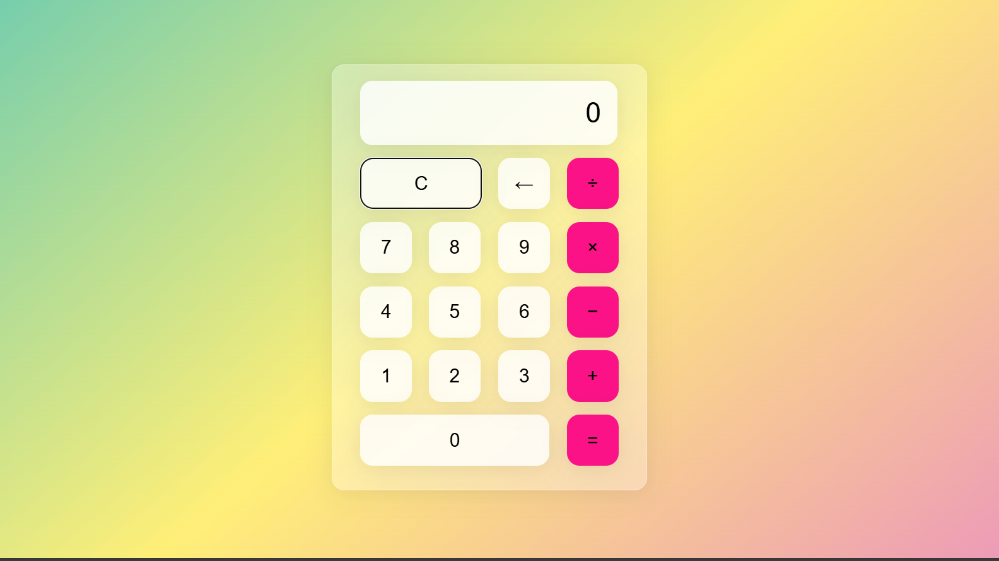

# Culculator-jash

# 🧮 Calculator App

A simple and clean calculator built with **HTML**, **CSS**, and **JavaScript**. This project performs basic arithmetic operations and features a responsive, minimalist design.

## 📸 Preview

<!--  Optional: replace with your own image or remove -->



## 🚀 Features

- Basic operations: Addition, Subtraction, Multiplication, Division
- Clear (`C`) button to reset
- Backspace (`←`) to delete the last digit
- Responsive design
- Keyboard-friendly UI (optional enhancement)

## 🛠️ Built With

- **HTML5** – Structure
- **CSS3** – Styling
- **JavaScript (Vanilla)** – Functionality

## 📁 Project Structure


## 🧑‍💻 How to Use

1. Clone the repository:
   ```bash
   git clone https://github.com/jashvanth370/Culculator-jash
2.

   📡 Live Demo
You can view the live version here 
3.

✅ To Do
 Add decimal point support

 Add keyboard input support

 Improve UI/UX with animations or themes

4.

📃 License
This project is licensed under the MIT License.

5.

💡 Author
Jash
GitHub: @jashvanth370
